# SSMART OFFICE

## 💡 영상 포트폴리오

[SSMART OFFICE **영상 포트폴리오** 보러가기](https://youtu.be/gyyz6IFZmK8)

## 📑 LOGO

## 🚩 목차

1. 기획 배경
2. 서비스 소개
3. 기능 소개
4. 기술 스택
5. 프로젝트 일정 및 기타 산출물
6. 팀원 소개 및 소감

## ✨ 기획 배경

### 개요

- 한 줄 설명 : 직원 근태 관리부터 회사 복지 포인트까지, 효율적인 인사 관리를 위한 올인원 프로젝트
- 서비스명 : **SSMART OFFICE**

### 목적

- 한 곳에서 다양한 **인사 관리 기능** 제공
- 근태 관리와 **복지 포인트** 통합 관리
- 대시보드를 통한 **실시간 근태 현황 및 기록 조회**
- **관리자 페이지**를 통한 보안 강화 및 효율적 관리

### 현 상황

- HR 성과관리 솔루션 스타트업들 '주목', [업무 방식을 혁신적으로 바꿀 것](https://www.the-stock.kr/news/articleView.html?idxno=17678)
- 인사 관리의 디지털 전환 가속화 [클라우드 기반의 HR 솔루션 도입을 적극 추진](https://brunch.co.kr/%40a2424c82fc944a6/1)

## ✨ 서비스 소개

### 페르소나

- 중소기업 인사 담당자 **정민수** 씨
  - **통합 관리 필요**: 근태 관리, 복지 포인트 지급, 연차 관리 등 다양한 업무를 하나의 시스템에서 처리하고 싶어 한다.

  - **효율적 데이터 관리**: 직원의 근태 현황과 복지 포인트 사용 내역을 실시간으로 확인하고 분석할 수 있는 기능을 원한다.

  - **직관적인 대시보드**: 복잡한 데이터를 시각적으로 쉽게 확인하고 보고서를 작성할 시간을 줄이고 싶어 한다.

  - **보안 강화**: 직원의 민감한 데이터를 안전하게 관리할 수 있는 보안 기능을 중요하게 생각한다.

  - **자동화된 업무 프로세스**: 반복적인 수작업을 줄이고, 휴가 승인 및 복지 포인트 관리 등을 자동화하고 싶어 한다.

### 기대효과

- **업무 효율성 증대**: 근태, 연차, 복지 포인트를 통합적으로 관리함으로써 인사 업무의 효율성을 높임

- **실시간 데이터 활용**: 대시보드와 보고서 기능을 통해 인사 데이터를 실시간으로 분석하고 빠르게 의사 결정을 내릴 수 있음

- **보안 강화**: 민감한 인사 데이터를 안전하게 관리하여 데이터 유출 방지 및 신뢰도 확보

- **직원 만족도 향상**: 체계적인 복지 포인트 관리와 실시간 현황 제공으로 직원들의 복지 체감도를 향상

- **시간 절감**: 자동화된 프로세스를 통해 단순 업무에 소요되는 시간을 절감하고 전략적 업무에 집중 가능

## ✨ 기능 소개

- **근태 관리**
  - **생체 인증**: 얼굴 및 음성 인식을 통해 본인 인증을 강화하여 보안을 향상시킵니다.
  - **대시보드**: 관리자는 모든 직원의 출/퇴근 기록과 일정을 캘린더 형태로 손쉽게 확인할 수 있습니다.
  - **NFC 카드**: 공유 NFC 카드를 사원증처럼 활용하여 퇴근 전까지 편리하게 사용 가능합니다.

- **자율 좌석제** 
  - **NFC 태깅**: 자신의 NFC 카드를 사용하여 원하는 좌석에 태깅하면 사용이 가능합니다.
  - **센서 기반**: 적외선 센서를 활용해 10분 이상 자리를 비울 경우 자동으로 좌석 현황이 업데이트됩니다.
  - **실시간 현황**: 실제 좌석 배치를 기반으로 좌석의 사용 여부를 실시간으로 확인 가능하며, 관리자는 좌석 배치를 수정할 수 있습니다.

- **복지 포인트**
  - **NFC 태깅** : NFC 카드를 활용하여 간편하게 복지 포인트를 사용할 수 있습니다.

- **일정 관리**
  - **캘린더** : 개인 일정은 물론, 관리자는 모든 직원의 일정을 한눈에 확인할 수 있습니다.
  - **간편한 일정 관리** : 모달 창을 통해 일정을 쉽게 추가하거나 삭제할 수 있습니다.

- **사내 메시지**
  - **메신저** : 사내 직원들과 실시간으로 메시지 및 파일을 주고받을 수 있습니다.
  - **메시지 및 파일 관리** : 읽지 않은 메시지와 수신한 파일을 한곳에 정리하여 빠르게 찾을 수 있습니다.
  - **좌석 및 현재 상황** : 상대 직원의 현재 상태와 좌석 정보를 확인할 수 있습니다.

- **사용자 & 관리자**
  - **관리자 모드** : 사원을 추가하거나 모든 사원의 근태 관리 및 좌석 배치를 수정할 수 있습니다.
  - **로그인 & 로그아웃** : JWT Token을 사용하여 안전한 로그인 및 로그아웃이 가능합니다.

## ✨ 기술 스택

| Category              | Details                                                                               |
| --------------------- | ------------------------------------------------------------------------------------- |
| **프론트엔드**        | Javascript, React, Vite, Zustand, STOMP                                               |
| **백엔드**            | Kotlin, Spring Boot, Spring Cloud, Spring Security, Spring Data JPA, STOMP            |
| **데이터베이스**      | MySQL, MongoDB, Redis                                                                 |
| **메시지큐**          | Kafka                                                                                 |
| **배포환경**          | AWS(EC2, S3)                                                                          |
| **배포도구**          | Docker, Nginx, Jenkins                                                                |
| **얼굴 생체 인식 AI** | ArcFace(최종선정), VGG-Face, GoogleFaceNet, DeepID                                    |
| **목소리 인식 AI**    | Wav2Vec2, ECAPA-TDNN, Wav2Vec2 Bert(최종선정), LSTM ensamble                          |
| **출/퇴근 HW**        | Rasberry pi LCD 7인치, Jetson Nano 2Gb, 스피커(mosu), 카메라(Logi), PN532, RFID RC522 |
| **좌율 좌석제 HW**    | Rasberry pi LCD 7인치, Rasberry pi 3, Pn532 ,RFID RC522                               |
| **결제 HW**           | Arduino Uno, RFID RC522, 1602a lcd                                                    |
| **협업툴**            | Git Lab, JIRA, Mattermost, Notion, Figma                                              |

## ✨ 아키텍처 설계도

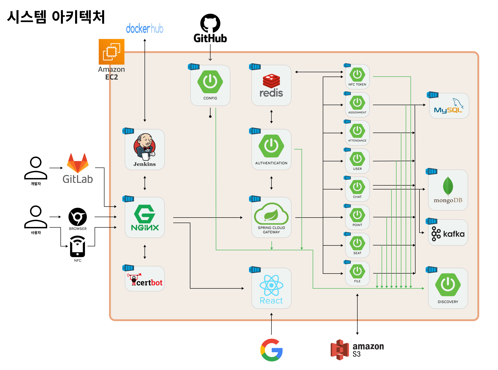

## ✨ 프로젝트 일정 및 기타 산출물

### 프로젝트 일정

**전체 일정** : 2024.10.14 ~ 2024.11.19(총 37일)

- **기획** : 2024.10.14 ~ 2024.10.20(총 7일)
- **개발** : 2024.10.21 ~ 2024.11.19(총 30일)

### Git Flow

[🔎자세히보기](https://festive-ornament-16c.notion.site/git-122a498062d980c195c9d1abf091c1ac?pvs=4)

### 기능 명세서

[🔎자세히보기](https://festive-ornament-16c.notion.site/120a498062d980c9ac31dec3b6398cbf?pvs=4)

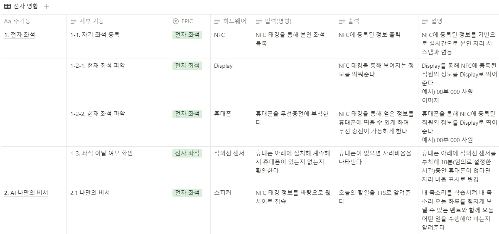
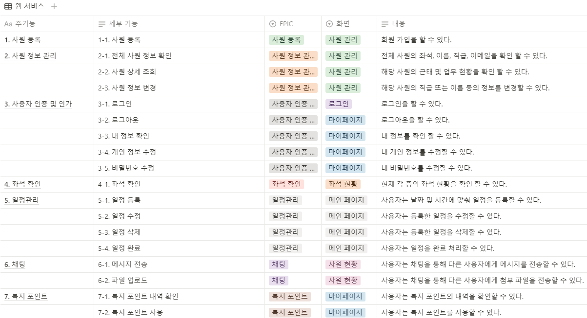

### 피그마 화면 정의서

[🔎자세히보기](https://www.figma.com/design/xOkH7g4jceb80E6nhXHu98/%EC%9E%90%EC%9C%A8-B202?node-id=205-539&t=rQqPEhB2IAFzLgMB-1)

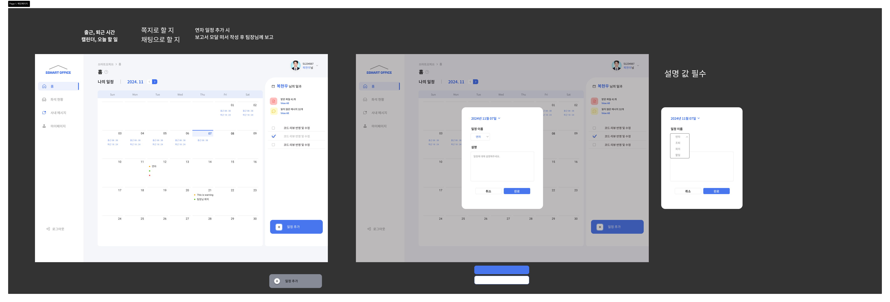

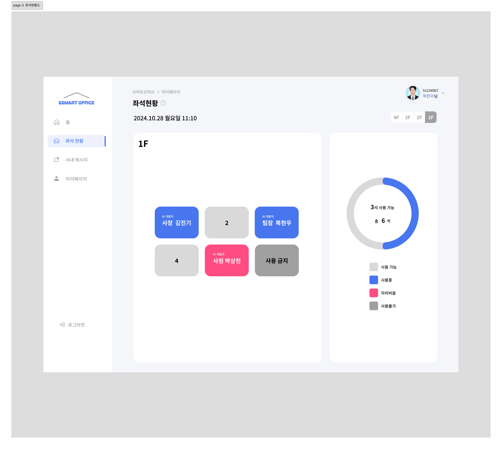

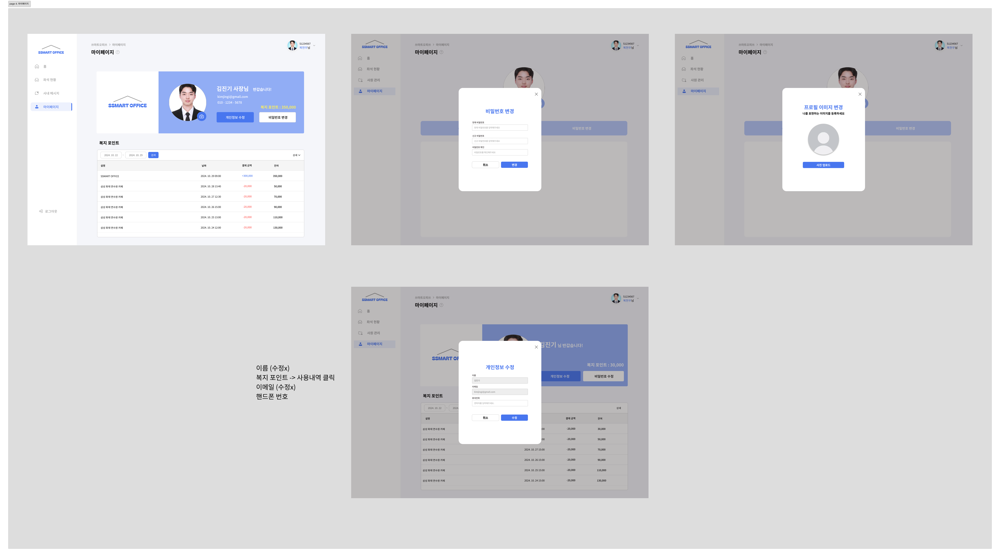

### ERD

[🔎자세히보기](https://www.erdcloud.com/d/beHM7c3NhsRTXy2zt)

### API 명세서

[🔎자세히보기](https://documenter.getpostman.com/view/39443888/2sAY4xAhGy)

<table border=1>
  <tr>
    <td>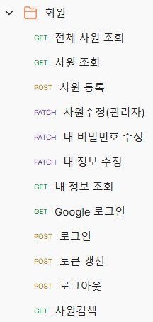</td>
    <td>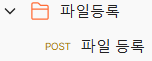</td>
    <td></td>
    <td></td>
  </tr>
  <tr>
    <td>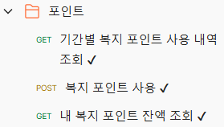</td>
    <td>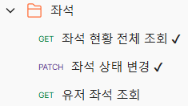</td>
    <td></td>
    <td></td>
  </tr>
</table>

## ✨ HW

<table>
  <tr>
    <td align="center">
      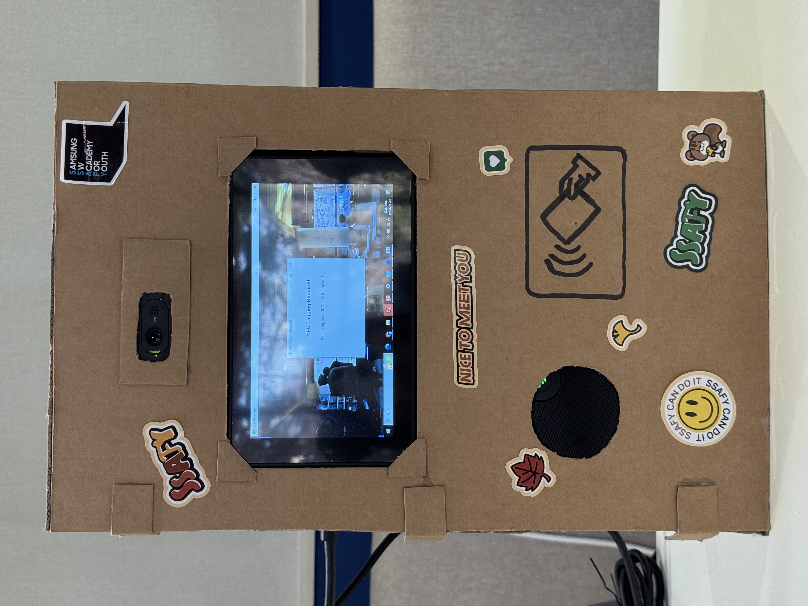
      
출퇴근HW

    </td>
    <td align="center">
      
      
내부

    </td>
  </tr>
  <tr>
    <td align="center">
      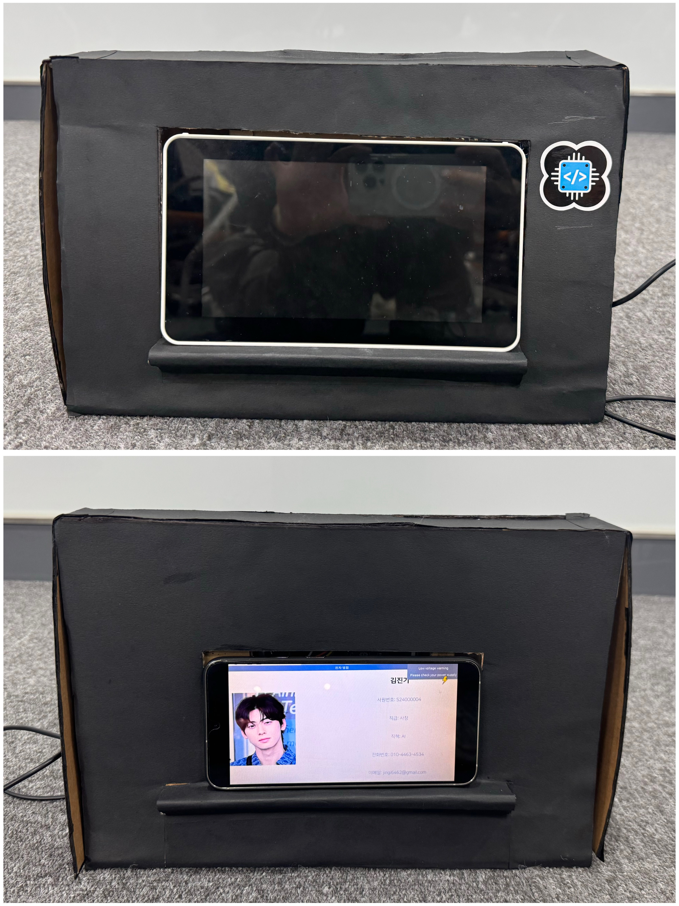
      
명패HW

    </td>
    <td align="center">
      
      
내부

    </td>
  </tr>
  <tr>
    <td colspan="2" align="center">
      
      
복지포인트HW

    </td>
  </tr>
</table>

## ✨ 화면

|  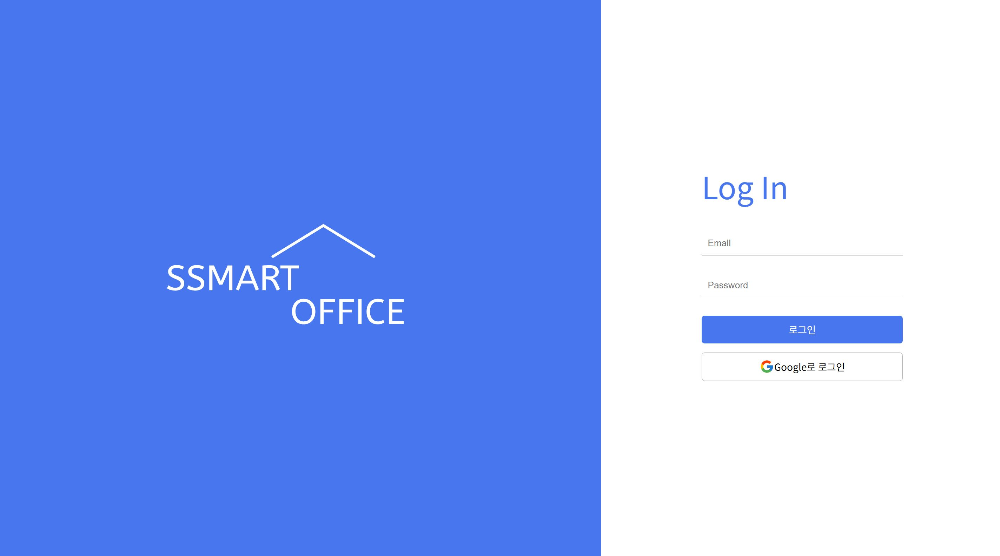   |  |
|:-------------------------------------:|:----------------------------------:|
|                  로그인                  |                홈페이지                |
|       |    |
|                  좌석                   |                 채팅                 |
|  |  |
|                 마이페이지                 |                사원관리                |

## ✨ 시연영상

|     |  |
|:-------------------------------------:|:----------------------------------:|
|                  얼굴 인식                  |                음성인식                |
|       |    |
|                  좌석ON                   |                 좌석OFF                 |
| 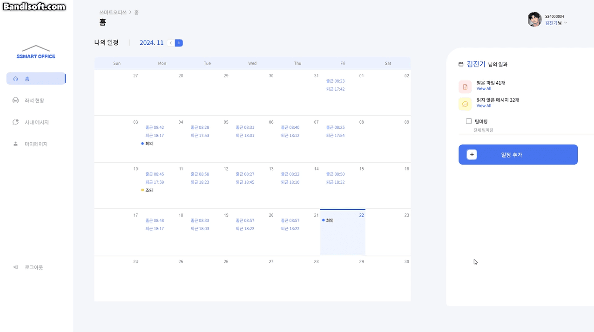 | 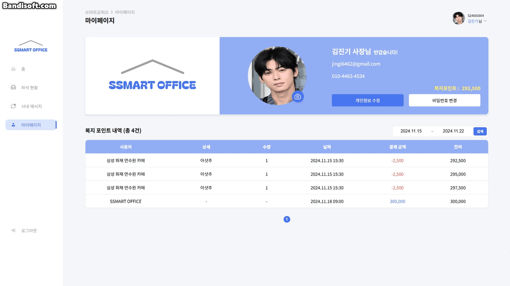 |
|                 일정관리                 |                 복지포인트                 |
|  |  |
|                좌석 태깅                  |                복지포인트                |

## ✨ 소감

|                     이름                     |     역할     | 상세                                                       | 소감                                                                                                                                                                                                                                                                                                                                                                                                                                                                                                                                                                                                                                                                                                                                                                                                                                                                                                                                                   |
|:------------------------------------------:|:----------:|:---------------------------------------------------------|------------------------------------------------------------------------------------------------------------------------------------------------------------------------------------------------------------------------------------------------------------------------------------------------------------------------------------------------------------------------------------------------------------------------------------------------------------------------------------------------------------------------------------------------------------------------------------------------------------------------------------------------------------------------------------------------------------------------------------------------------------------------------------------------------------------------------------------------------------------------------------------------------------------------------------------------------|
|  김진기(팀장) | AI   HW | - 음성 인식 AI, 얼굴 인식 AI, 출퇴근 HW                             | 이번 프로젝트는 시작부터 끝까지 도전과 성취로 가득한 프로젝트었습니다. 얼굴 생체 인식과 목소리 인식이라는 첨단 기술을 활용해 실생활에서 적용 가능한 시스템을 구축하는 과정은 단순히 기술적인 성취를 넘어 끈기와 문제 해결 능력을 시험하는 시간이었습니다.   진행 과정에서는 예상치 못한 난관이 많이 있었습니다. 센서가 세 번이나 고장 나고, Jetson Nano가 작동하지 않는 등 하드웨어 문제가 프로젝트를 멈추게 할 뻔한 상황도 있었습니다. 하지만 이러한 상황 속에서도 포기하지 않고 대안을 찾고 문제를 하나씩 해결해 나갔습니다. 때로는 새로운 부품을 구비하고, 때로는 로직을 수정하며 끊임없이 도전했습니다. 이러한 경험 덕분에 어려움 속에서도 해결책을 모색하고 끝까지 프로젝트를 완성하는 끈기를 배울 수 있었습니다.   결국 모든 시스템이 안정적으로 작동하며 프로젝트가 성공적으로 마무리되었을 때, 그동안의 노력이 헛되지 않았음을 느꼈습니다. 이 과정에서 얻은 기술적인 지식뿐 아니라, 어떤 어려움에도 굴하지 않고 끝까지 나아가는 태도가 큰 성과로 다가왔습니다. 이번 프로젝트는 단순한 작업을 넘어, 성장의 기회이자 앞으로의 도전에 대한 자신감을 얻은 귀중한 경험이 되었습니다.                                                                                                                                                                                                                                                                                                           |
|     정원빈  |     FE     | - 로그인, 마이페이지, 좌석현황                                       | 이번 SSMART OFFICE 프로젝트는 React, Vite, Zustand, WebSocket, STOMP, JWT 등 다양한 기술 스택을 활용하며 진행되었고, 스마트 오피스 환경을 구현하는 데 중점을 두었습니다. 특히 얼굴 인식과 음성 인식을 활용한 출입 관리, NFC 태깅을 통한 자율좌석제, 일정 및 회원 관리, 복지 포인트 활용 등의 기능을 개발하며 실제 업무 환경에서 편리함을 제공할 수 있는 서비스를 구현했습니다.  저는 프로젝트에서 로그인, 회원가입, 좌석 현황, 복지포인트 현황, 회원 수정 기능을 담당했습니다. 이 과정에서 사용자 중심의 기능을 구현하기 위해 고민하고, 상태 관리와 데이터 처리에 효율성을 더하려고 노력했습니다. 모달을 중앙에서 관리할 수 있도록 구현했던 부분은 특히 의미 있는 경험이었으며, 협업 과정에서도 여러 컴포넌트 간의 일관성을 유지하는 데 큰 도움이 되었습니다.  아쉬운 점도 있었습니다. Suspense나 Error Boundary와 같은 고급 기능을 활용하지 못한 점이 가장 아쉽습니다. 대신 이를 보완하기 위해 오류 처리를 중앙에서 최대한 효율적으로 관리하려고 노력했으며, 이 과정 자체가 많은 배움으로 이어졌습니다. 다음 프로젝트에서는 Error Boundary를 적극적으로 활용해 더 안정적인 사용자 경험을 제공할 수 있는 서비스를 구현하고 싶습니다.  이번 프로젝트를 통해 다양한 기술 스택의 유기적인 연결을 경험하며 프론트엔드 개발의 넓은 가능성과 어려움을 모두 느꼈습니다. 새로운 기능을 학습하고 이를 적용하는 과정에서 시행착오도 많았지만, 이러한 과정을 통해 실질적인 성장과 성취감을 느낄 수 있었습니다.  마지막으로, 프로젝트를 통해 협업과 기술적 도전의 중요성을 다시 한번 깨달았습니다. 앞으로도 이번 경험을 발판 삼아 더 발전된 서비스를 개발할 수 있도록 노력하겠습니다.|
|     이소연  |     FE     | - 채팅, 일정관리                                               | SSAFY 마지막 프로젝트는 제게 많은 도전과 배움의 기회를 안겨준 시간이었습니다. 이번 프로젝트에서는 다양한 기술을 접목시키고자 AI와 하드웨어를 활용한 스마트오피스를 기획했으며, React를 중심으로 개발을 진행했습니다.   짧은 시간 안에 기획, 디자인, 개발을 완료해야 했기 때문에 기획 단계가 다소 느슨하게 이루어졌지만, 팀원 모두가 뛰어난 역량을 발휘해 원활하게 프로젝트를 진행할 수 있었습니다. 덕분에 React를 다시 한 번 체계적으로 활용해보는 값진 경험이 되었으며, 각 기술의 활용과 협업의 중요성을 깊이 깨달을 수 있었습니다. 이번 프로젝트는 제게 기술적 성장뿐 아니라, 효율적 팀워크와 창의적인 문제 해결 능력을 배울 수 있는 소중한 기회였습니다.                                                                                                                                                                                                                                                                                                                                                                                                                                                                                                                                                         |
|     이동복  | BE   HW | - 파일, 근태, 채팅, gateway, config, discovery 서버   - 명패 HW | 이번 프로젝트는 제게 단순히 기술적 도전이 아니라, 협력과 성장의 값진 경험으로 남았습니다. 유능한 팀원들과 함께 하드웨어와 소프트웨어를 만들어가며 서로의 아이디어를 나누고 협업한 모든 순간이 소중했습니다. 매일 아침 함께 회의를 진행하며 목표를 조율하고, 밤늦게까지 의견을 나누며 해결책을 찾아가는 과정은 힘들었지만 그만큼 보람찬 시간이었습니다. 이러한 노력의 결과로 팀원들과 함께 성취한 결과물을 보면 가슴이 뿌듯해집니다.  특히 이번 프로젝트는 단순히 계획한 대로 진행된 것이 아니라, 세 번의 주제 변경과 짧은 시간 동안 효율적으로 계획을 조율해야 했던 어려움이 있었습니다. 모두가 바쁜 일정 속에서도 실질적인 개발 시간이 겨우 2주밖에 되지 않았지만, 그 짧은 시간에 의미 있는 결과물을 만들어낼 수 있었다는 점은 팀원들의 뛰어난 실력과 협력 덕분이었습니다. 덕분에 저 역시 많은 부분에서 실력이 성장했다고 느낍니다.  이번 프로젝트는 SSAFY 마지막 프로젝트였기 때문에 더욱 아쉽기도 했습니다. 함께했던 모든 시간들이 저에게는 잊을 수 없는 추억으로 남았고, 동시에 앞으로 어떤 도전이 와도 잘 해낼 수 있을 거라는 자신감을 심어준 소중한 경험이었습니다.                                                                                                                                                                                                                                                                                                                    |
|     김세민  |     BE     | - 회원, 인증, 포인트, 좌석, 일정 서버                                 | 기존 팀이 해체되고 마감이 3주도 남지 않은 상황에서 ‘쓰마트오피스’ 팀에 합류했습니다. 경험해 보지 않은 언어로 서버를 구축하고, IoT와 AI가 융합된 프로젝트에 참여할 수 있다면, 한 단계 성장할 기회라고 생각했기 때문입니다.    짧은 일정 속에서 기능 구체화, Kotlin 학습, MSA 아키텍처 도입까지 이뤄냈습니다. 늦게 합류한 만큼 팀에 적극적으로 이바지할 방법을 고민하며 기술적 기여와 협업 방식을 배울 수 있었습니다. 특히 인증 서버를 구축하면서 인증과 인가에 대해 고민을 많이 해볼 수 있었습니다. 이번 프로젝트를 통해 새로운 기술을 빠르게 습득하고 실전에 적용하는 자신감을 얻었습니다.    백엔드 개발 과정에서는 팀원이 기능 설계와 코드 작성에서 타당한 이유를 요구했기에, 이 부분에 토론하면서 즐겁게 개발에 몰입할 수 있었습니다. 각자의 몫을 믿음직하게 이뤄준 쓰마트 오피스 팀원들 감사합니다.🙂 덕분에 제 몫에 집중하면서 개발할 수 있었고, 많이 배웠습니다!!                                                                                                                                                                                                                                                                                                                                                                                                                                |
|     박상천 | Infra | - MSA 기반 인프라 설계, 구축, 운영                                  | 대규모 프로젝트를 진행하며 MSA 구조와 관련된 인프라 설계 및 구축을 맡았습니다. 프로젝트 초기에는 쿠버네티스를활용한 인프라를 구축하려고 시도했지만, 초반 학습 곡선과 더불어 다양한 문제들이 발생했습니다. 특히 데이터베이스 일관성 문제와 DNS 설정 문제는 예상보다 해결하기 까다로웠고, 이러한 문제를 해결하며 쿠버네티스의 네트워크 구성 및 서비스 흐름에 대해 깊이 이해할 수 있는 기회가 되었습니다. 그러나 프로젝트 일정과 팀원들의 요청을 고려해 단일 서버 기반의 MSA 구조로 전환하여 서비스를 안정적으로 운영할 수 있었습니다.   인프라 구축 후에는 팀원들이 STOMP를 활용해 실시간 채팅 기능을 구현하는 과정에서 발생한 어려움들을 함께 해결하며 팀의 협업을 도왔습니다. 이러한 과정을 통해 단순히 인프라 담당으로서의 역할을 넘어, 팀원들과 적극적으로 소통하며 프로젝트의 완성도를 높이기 위해 기여했습니다.   특히 이번 프로젝트는 마지막 프로젝트로, 더 큰 책임감을 느끼며 진행했습니다. 팀원들과 함께 밤을 새며 문제를 해결하고, 발생하는 이슈에 빠르게 대응하기 위해 머리를 맞대는 시간이 많았습니다. 이 과정에서 느낀 점은, 기술적인 역량뿐만 아니라 팀원들과의 협력과 소통이 프로젝트 성공에 핵심이라는 것입니다. 서로의 의견을 존중하고 문제를 공유하며 해결책을 모색한 결과, 프로젝트를 성공적으로 마무리할 수 있었습니다.  이번 프로젝트는 단순히 기술적인 성과뿐만 아니라, 대규모 환경에서 발생하는 트래픽 문제, 설정 관리, 네트워크 구성 등 실제 업무에서 접하게 될 다양한 문제들을 미리 경험하고 학습할 수 있는 소중한 기회였습니다. 더불어, 쿠버네티스를 포함한 컨테이너 오케스트레이션과 MSA 구조의 실무 적용에 대해 실질적인 지식을 쌓으며 개인적으로도 크게 성장할 수 있었습니다.  |
